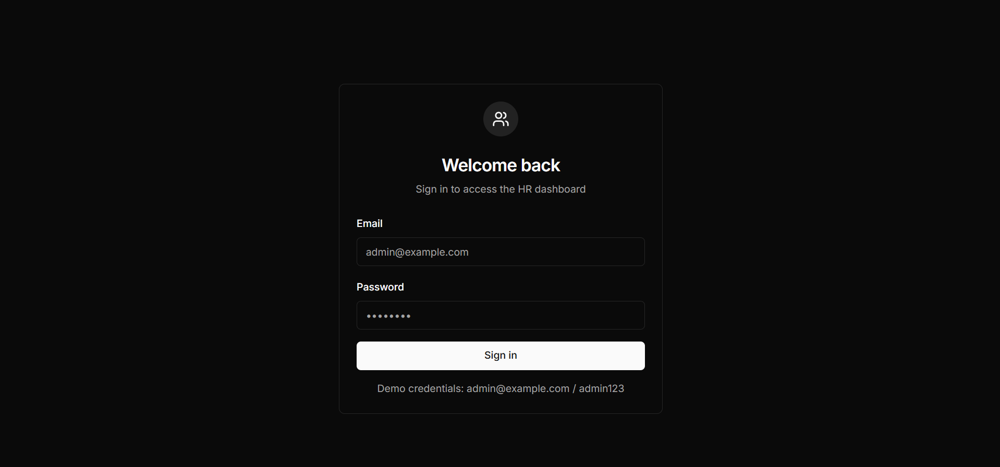
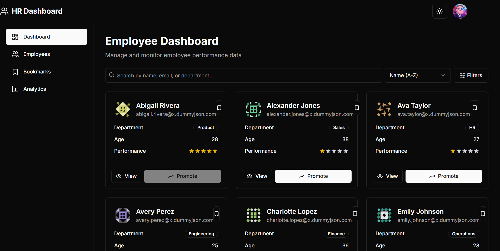
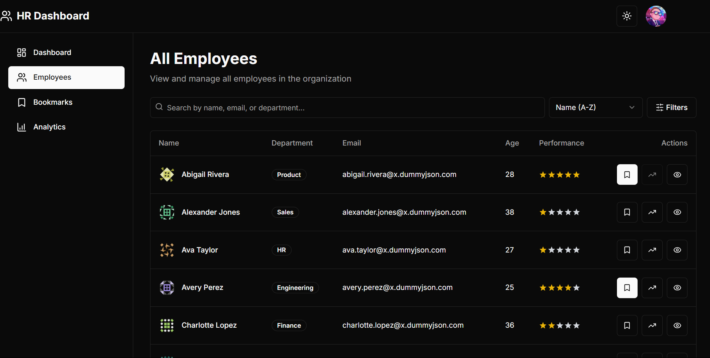
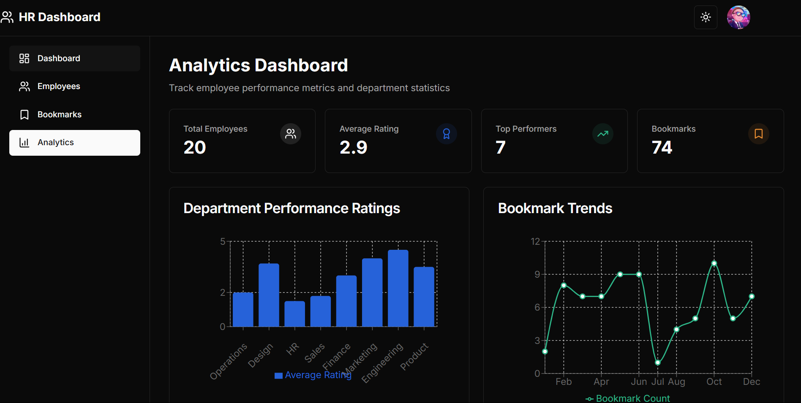
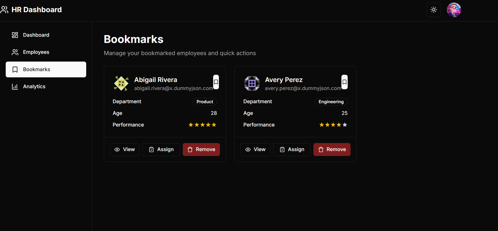

# 👥 HR Dashboard Website

A modern HR dashboard web application built with **Next.js**, **TypeScript**, and **Tailwind CSS**. This dashboard visualizes employee performance, departmental insights, and key HR analytics to help organizations manage their workforce effectively.

---

## 🚀 Features

- 📊 **Real-Time Analytics** — View dynamic metrics like employee count, top performers, and average ratings
- 🧑‍💼 **Department-wise Performance** — Visual breakdown of team contributions
- 📈 **Bookmark Trends** — Simulated activity over time
- 🧩 **Interactive Charts** — Powered by `Recharts` for dynamic visualization
- 💻 **Responsive UI** — Optimized for desktop and mobile
- 🦴 **Skeleton Loading** — Smooth loading experience

---

## 📸 Screenshots

### 📍 Sign-In Authentication


### 📍 Dashboard Overview


### 📍 All Employees List


### 📍 Department Performance Chart


### 📍 Bookmark Trends


---

## 🛠️ Tech Stack

- **Framework**: Next.js 13+
- **Language**: TypeScript
- **UI**: Tailwind CSS
- **Charts**: Recharts
- **Icons**: Lucide
- **Data**: [DummyJSON API](https://dummyjson.com/users?limit=20)

---

## 🧪 Getting Started

1. **Clone the repository**

   ```
   git clone https://github.com/ndattatreya/Flam_Assignment.git     cd <repo_name>
   ```

2. **Install dependencies**

   ```
   npm install (or) npm i
   ```

3. **Run the development server**
   ```
   npm run dev
   ```

5. Open `http://localhost:3000` in your browser.

---

## 📁 Folder Structure

```
.
├── components/         # Reusable UI components
├── hooks/              # Custom React hooks
├── lib/                # Utility functions
├── app/                # Pages and layouts (Next.js App Router)
├── screenshots/ # Screenshot assets for README
```

---

## 🙌 Acknowledgements

* [DummyJSON](https://dummyjson.com/users) for free dummy API
* [ShadCN UI](https://ui.shadcn.com) for elegant components
* [Lucide Icons](https://lucide.dev) for open-source icons
* [Recharts](https://recharts.org/) for interactive charts

---

## 📃 License

This project is licensed under the **MIT License**.

---

## 📬 Contact

For suggestions or feedback, reach out at: [dattatreya.nammina1@gmail.com](mailto:dattatreya.nammina1@gmail.com)

```
